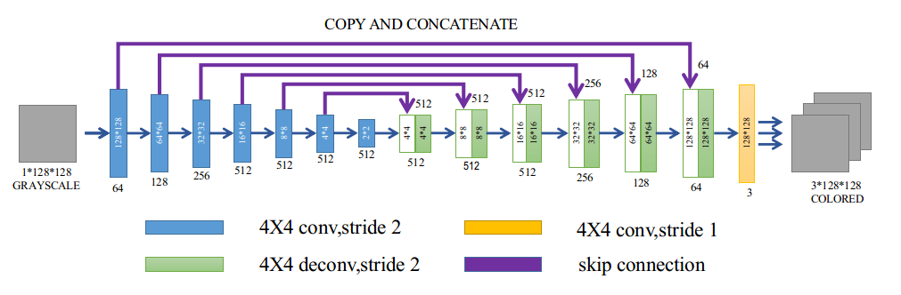
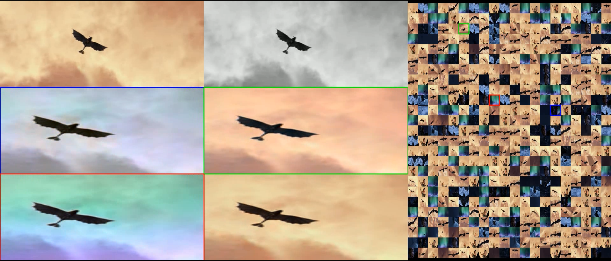

# DeepLearningProject: Animation Colorization with Memory-Augmented Networks

## Overview

The project is to reproduce the Memory-Augmented Networks proposed by [Coloring With Limited Data: Few-shot Colorization via Memory Augmented Networks](https://arxiv.org/abs/1906.11888).

## Requirement

* python-opencv
* matplotlib
* pytorch 1.1.0
* skimage
* sklearn
* numpy

## Outline

* How to generate dataset
* How to use generated dataset to train your model
* How to use trained model to perform testing
* Video demonstration

## How to generate dataset

The file `dataset_generator.py` can be used to extract image frames from videos. I use VideoCapture from OpenCV to load the video and calculate the color distribution difference between two neighboring image frames. A series of image frames can be called a shot. I keep shots in which the difference between all the neighboring image frames is within a threshold and whose length is within another threshold. Finally, I use `np.random.choice` to randomly save images from these shots to train/val/test folders. The default proportion of assigning images to train/val/test folders is 0.7:0.2:0.1. You can change this proportion as you wish in the file. The images will be named as `raw_image_videoname_number.png`.

The file takes five parameters:
* video_path: The path of the videos
* video_names: The video names
* save_path: Where you want to save the extracted images. The file will create a base folder in this path and create train/val/test folders inside the base folder.
* col_diff_thres: threshold of the color distribution difference.
* shots_len_thres: threshold of the length of the shots. You can customize the last two parameters to control the number of images you want to obtain.

***Note:*** There is a conflict between ROS and OpenCV so that I add the following code to my file. If you don't use ROS, please remove them.
```
import sys
sys.path.remove('/opt/ros/kinetic/lib/python2.7/dist-packages')
```

## How to use generated dataset to train your model

You can use `train.py` file to train your own model.

### Initialize Dataset and DataLoader

The train and validation datasets are initialized by loading the images from the train/val folders mentioned in the previous section and implementing some processing to these images.

The processing details can be found in the file `dataset.py`. If we see this processing as a black box, it inputs the images from the train/val folders and outputs python dicts which contain the 5 elements: L channel of the images, ab channels of the images, color features of the images, greyscale images and image identities or numbers.

Assume we have an image whose size is 256x256x3. Then the size of its ab channels is 256x256x2 and the number of total pixels is 256x256. The color feature of each pixel can be represented by a pair of ab values [a, b]. Therefore, the color features of the image can be represented by 256x256 pairs of [a, b] values. According to [Colorful Image Colorization](https://arxiv.org/abs/1603.08511), there are 313 possibilities of [a, b] pairs. Then we can map these 256x256 pairs of [a, b] values to a 313 possibility vector. This 313 possibility vector will be treated as our final color features of the image.

In the previous section, I mentioned that all the saved images will be named as `raw_image_videoname_number.png` and each image has a unique number. We can extract this number from its name and treat this number as the identity of the image.

The DataLoader will load a batch of elements in the datasets according to the `batch_size` parameter during the training phase.

### Initialize Networks

You can choose to train your networks in three different ways.
* Train a basic generative adversarial network(GAN) for colorization. If you want this option, please set the parameters `use_memory` as `False`, `use_feat_integrator` as `False`, `gen_norm` as `batch` and `dis_norm` as `None`.
* Train a GAN with memory but without feature integrator for colorization. If you want this option, please set the parameters `use_memory` as `True`, `use_feat_integrator` as `False`, `gen_norm` as `adain` and `dis_norm` as `adain`.
* Train a GAN with memory and feature integrator for colorization. If you want this option, please set the parameters `use_memory` as `True`, `use_feat_integrator` as `True`, `gen_norm` as `adain` and `dis_norm` as `adain`.

The first option allows you to train a vanilla GAN for colorization. Setting `gen_norm` as `batch` makes each convolutional layer of the generator followed by a batch normalization layer.

The second option allows you to train a GAN with a memory, which is the official version presented in the paper. Setting `gen_norm` as `adain` makes each convolutional layer of the generator followed by a adaptive instance normalization(AdaIn) layer, which is used for style transfer. During training phase, the parameters of AdaIn layers are set by color features from the ground truth images. During validation phase, parameters of AdaIn layers are set by color features from the top-1 memory.

The third option allows you to train a GAN with a memory and a feature integrator. During training phase, the parameters of AdaIn layers are set by color features from the ground truth images and the feature integrator learns the weights to combine top-1, top-2 and top-3 memory so that the combined feature is as close to ground truth feature as possible. During validation phase, parameters of AdaIn layers are set by color features from the combination of top-1, top-2 and top-3 memory on the basis of learned weights of the feature integrator.

***Note:*** All the source code of the networks(generator, discriminator, memory network, feature integrator) can be found in `networks.py`. The generator follows a U-Net architecture(See figure below). You can customize your network by adding and removing layers. Also, you can use your own generator and discriminator. 

### Optimizers and Losses

All the networks use Adam optimizer. We follow the idea in this [paper](https://arxiv.org/abs/1803.05400) to set the optimizer momentum term as 0.5 for the generator and discriminator.

We made a small modification to the loss function of the generator from the original paper. We added a regulation term `lambda` to control the regulation effect of the L1 loss between the output image and the ground truth image. We set this regulation term as 100 to make this the output image as similar to the ground truth image as possible. The memory network still uses the Threshold Triplet Loss for unsupervised training. The feature integrator uses the KL divergence between the combined color feature and the ground truth color feature as the loss.

### Saving Models and Validation Results

You can change the parameter `save_path` to the desired path where you want to save you model weights and validation colorization results. You can change the parameter `save_freq` to state you want to save model weights after training how many epochs. You can change the parameter `start_epoch` to start training from a certain epoch by loading saved model weights from that epoch. The parameter `end_epoch` decides the maximum training epoch.

## How to use trained model to perform testing

You can use `test.py` file to perform test with your trained model.

Similar to the previous section, you can choose to perform test in four different ways.
* Test with a basic generative adversarial network(GAN). If you want this option, please set the parameters `use_memory` as `False`, `use_feat_integrator` as `False` and `gen_norm` as `batch`.
* Test with GAN with style transfer. If you want this option, please set the parameters `use_memory` as `False`, `use_feat_integrator` as `False` and `gen_norm` as `adain`.
* Test with a GAN with memory but without feature integrator for colorization. If you want this option, please set the parameters `use_memory` as `True`, `use_feat_integrator` as `False`, and `gen_norm` as `adain`.
* Train a GAN with memory and feature integrator for colorization. If you want this option, please set the parameters `use_memory` as `True`, `use_feat_integrator` as `True`, and `gen_norm` as `adain`.

The purpose of the second option is to check how well the memory network can perform when the color feature provided by the memory is perfect.

You should set parameters `mem_model_path`, `mem_generator_model_path`, `feat_model_path` as the path where you have saved your memory model, generator model and feature integrator model. You should set parameters `save_path` as the path where you want to save your test images.

## Video demonstration

This video demonstration is realized by running `demonstration.py`. I use the Animation *How to train your dragon 3: The hidden world 2019* to make the datasets and train models in different ways and use these models to colorize a greyscale video to compare the effects of these models. This video can help you better understand what is the function of the memory part.



Here I select one video screen shot to describe the content of different parts of the video.

* Top-left video frame: ground truth
* Top-left video frame: greyscale
* Middle-left video frame: greyscale colorized by top-1 feature from the memory.
* Middle-right video frame: greyscale colorized by top-2 feature from the memory.
* Bottom-left video frame: greyscale colorized by top-3 feature from the memory.
* Bottom-left video frame: greyscale colorized by color feature from the ground truth with style transfer.
* Image Array: the memory of the network.

Middle-left video frame is surrounded by a ***large blue box*** so that it is colorized by color feature in the memory cell which is surrounded by a ***small blue box*** so that it features a greyish style.

Middle-right video frame is surrounded by a ***large green box*** so that it is colorized by color feature in the memory cell which is surrounded by a ***small green box*** so that it features a orange style.

Bottom-left video frame is surrounded by a ***large red box*** so that it is colorized by color feature in the memory cell which is surrounded by a ***small red box*** so that it features a rainbow style.

You can watch the full video below. You will realize that sometimes that keeping using the top-1 color feature from the memory is not a good choice because top-2 or top-3 feature has a better color feature which is closer to the color feature from the ground truth. That is the reason why we intent to upgrade the network with a feature integrator.

[](https://www.youtube.com/watch?v=rnFcCVl6y-M)
